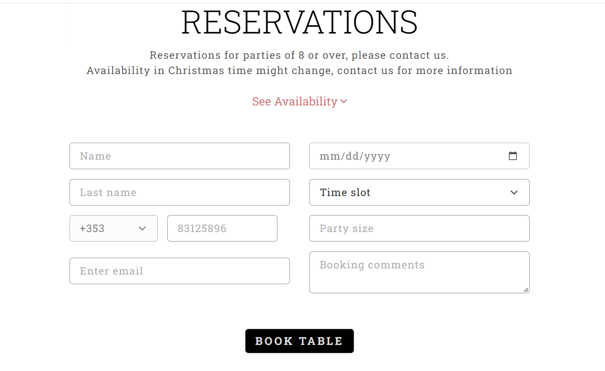
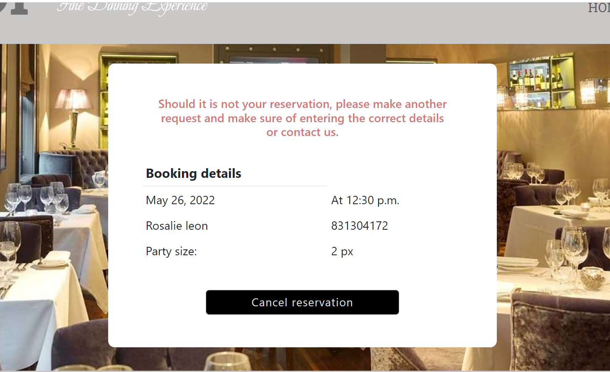
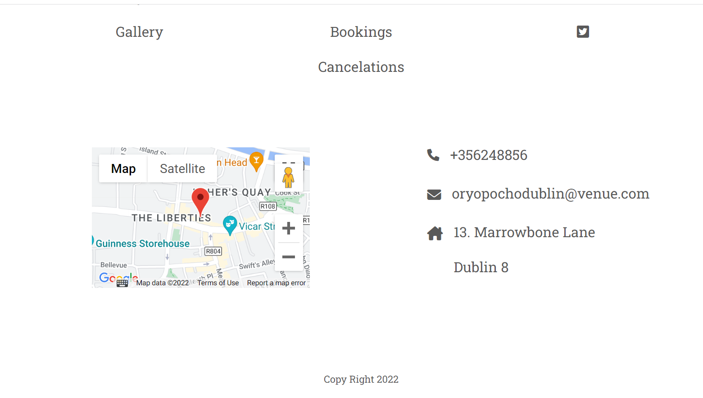
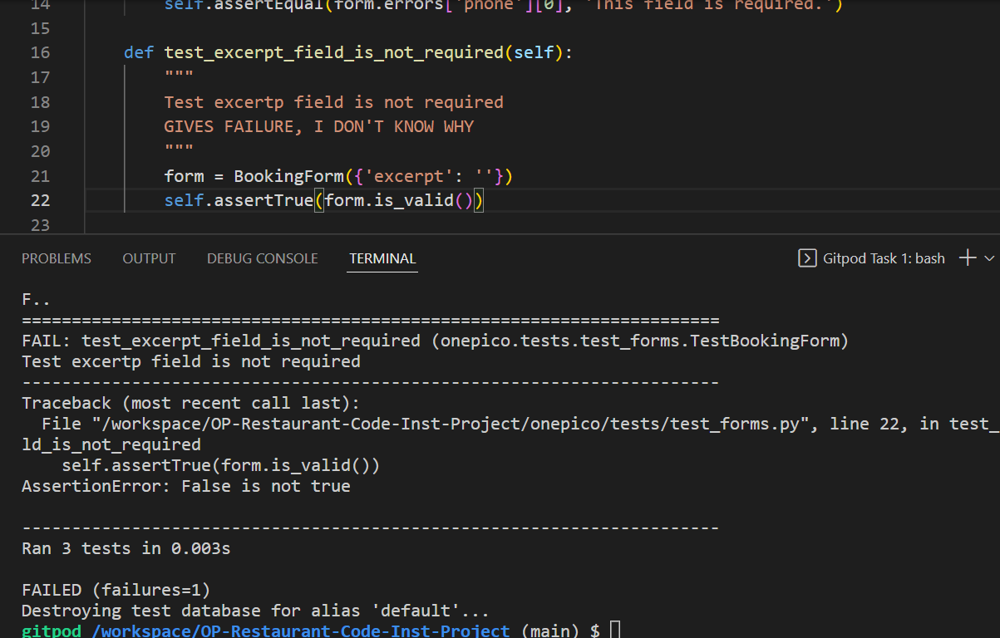
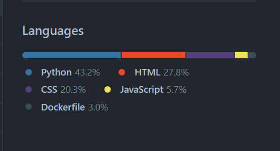

# Oryo Pocho Restaurant

This is a Restaurant site which provides valued information about the restaurant itself, and allows user make bookings easily whit a very intuitive navigation and a straightforward booking request form.

- Go to live [Orio Pocho](<https://one-pico-restaurant.herokuapp.com/)>)

# Table of contents

###  [Planning stage](#planning-stage)

- Target audience
- User stories
- Design goals
- Design choises
- Font
- Color scheme
- Wireframes
- Flow chart

### [Features](#features)

 - Make reservations
 - Search existings reservations
 - Cancel reservations
 - Reservation form validation
 - Send contact email to management
 - Maps

### [Future Features](#features)

### [Testing](#testing)

- Manual Testing
- Automated testing
- Light house
- Validators

### [Technology Used](#technology-used)

- Languages
- Libraries

### [Bugs](#bugs)

- Fixed bugs
- Unfixed bugs

### [Deployment](#deployment)

### [Credits](#credits)

- Content
- Acknowledgements

# Planning Stage

## Target audience

People interested in celebrating a special ocasion, wanting to make a reservation, as well as interested in knowing what the restaurant is about, cancel a reservation or contact the management venue.

## User Stories

- As an **User** I want to...
  
  - An intuitive navigation.
  - Access the site from any size screen.
  - See restaurant availability.
  - See restaurant contact details.
  - Check what the restaurant is about.
  - See images of the venue and food.
  - Be able of making reservations through the website.
  - Be able of canceling reservations through the website.
  - Send email to the management.

- As an **Admin** i can...

  - Get into reservations records so that I can easily manage data.
  - Filter and search all custom models from the admin page so that I can utilize the admin page to        review, edit and delete data quickly.
  - Easily navigate the admin panel so that I can view, search, add and delete records.

## Design goals

- Minimalistic design
- Well structured information
- Easi readability
- Intuitive navigation
- Straightfroward forms
- Resposive for all screen sizes
  - Desktop
  

  - Tablet
  

  - Mobile
  

## Design choises

### Fonts 

Fonts were taken from [Google fonts](<https://fonts.google.com/>)

- For paragraphs, headings, and links 'Roboto Slab', serif
- For logo paragraph, 'Beau Rivage', cursive

### Color scheme

- Logo color: #727272;
- Body background color: #fff;
- Navigation bar background: #cac7c7;
- Navigation bar and : rgb(89, 89, 89);
- Headings color: #000000;
- Link color: rgb(89, 89, 89);

## Wireframes

 * Desktop and mobile **home** page wireframe.

 

 * Desktop and mobile **profile** page wireframe.

 

## Flow Chart

Sorry i can't provide this information. 
I was a bit disater and didn't work on the flow chart in advance, either on the database squemas..sorry.
I wanted to do draft them before submitting the project but i have not more time.
I'll do better for the next project!

# Features

- Make reservations

  - Users are able to make reservations through a straightforward interface

- Search existings reservations.
    
  - Users are able to search their reservations
  

- Cancel reservations.

  - Users can cancel their reservations.

  
- Reservation form validation

  - Form data is checked before submiting to ansure correct data is entered
  

- Send contact email to management

- Maps

  - As per the user to easily see venue's location without exiting the site

## Future features

  - **Reservations**
  Currently the reservations app can only take one table at a time, the posibility of joining tables and store them in database would make the app a real world and efficient application.

  - **Reviews**
  Could have a review section linked to tripadvisor or to open table from where potential customers could check people's opinions out easily from the website.

  - **Menus Examples**
  Menus examples could be displayed in a seperated pdf window from which interested users could print them out.

  - **User account**
  In case the company had some other venues, users could have a private account from which check and manage reservations from one single website and receive deals or news from them.

# Testing 

## Manual testing

- Front end testing:

During the development proccess, i used Dev tools for css styling, and also for validating forms with JavaScript, using "console.log()" method to check  whether if functions are triggered, or to check if the data passed into functions was the one i needed.

- Back end testing:

To check if functions are triggered or whether if the data or data type passed was the right one, i used the "print()" method.
To keep track of the reservtaions logic, and provide feedback to the console i used the print() in which i concastitate strings with real data, so that at all times a developer can see whats going on.

### Lighthouse

These test have been made at last minute before deathline project submition.
I would have loved to improve all the areas.

 - Home page:
   - Desktop
   
   - Mobile
   

- Reservation confirmation page:
   - Desktop
   
   - Mobile
   

- Cancelations page:
   - Destop
   
   - Mobile
   

  - **Home page**

### Validators

- HTML

  All HTML files were validated on [HTML W3 Validator](<https://validator.w3.org/>), all show a bunchfull of errors apparently caused by the  tag.

  
  

- CSS
 
 All CSS fiiles went through [CSS W3 Validator](<https://jigsaw.w3.org/>) and a few errors showned were corrected.

- JS

 JSHint was used to validate js files, only lost of semicolons missing and some variables unused

- PEP8

When validating i had to modify lots of long lines of code, however then when running the app,
the app crushes and display errors as on the picture bellow.

So i put back some of the long lines ofcode.

Due to small extra longer lines of code, i had to leave some errors from the file "reservation.py"

## Automated Testing

 - In order to run all the testing files 
 `python manage.py test onepico.tests`

 - In order to run specific test file
 `python manage.py test onepico.tests.<test_filename>`

ATTENTION!

There is one of the test functions failing from the "test_forms.py" file.
I don't really understand what's going on there, the booking comment field is not required whe submitin the form, andfrom my undertanding the test function should go through as "excerpt" field is left blank and the form submitions should be valid...

# Technology used

  - Languages used according to **Github** reports.

  

  - Libraries

    - Front-end:

    1.[JQuery](<https://jquery.com/>)
    2.[Animate.css](<https://animate.style/>)
    3.[Cloudinary](<https://cloudinary.com/>)
    4.[Fontawsome](<https://fontawesome.com/>)
    5.[Google Fonts](<https://fonts.google.com/>)

    - Back-end:

    1.[Summernote](<https://summernote.org/>)
    Still don't know what it is for...i have it installed for this proyect..i don't know why!

  - Frameworks

    1.[Boostrap](<https://getbootstrap.com/>)
    2.[Django](<https://www.djangoproject.com/>)
    3.All packages installed canbe fond in requirements.txt file

# Bugs

- Fixed bugs

I have come accross multiple bugs and didn't write them down...i'm a bit of a disaster..i gotta learn to organize work as i go

- Unfixed bugs

1.Currently from the cancelations page, the link back to home page does no work...

2.Reservation form validation has a bug when filling up the "name" field and leaving the "Last Name" field blankand trying to submit the form. The data error message bellow the "Last name" field is also displayed...

3.Cancel reservations form has also a couple of bugs.

  - Firstly when trying to submit the from black, the JavaScript validation code seems to not be triggered.
  and leads the user to a django ValidationError page

   

  - Secondly, when making fail the "email" field, the JavaScript validation code is triggered, but when leaving the "email" field empty and making fail the phone field, the JavaScript validation code is again no triggered..leading the user to the ValidationError

  

  

  - However, if we fill up the "date" field, input anything on the "phone" field, and leaving the "email" field blank, the user is lead to the response page after submitting the form..

   

4.Maps feature
This feature does not work in Heroku app, i had to add authoritation but i only realized right before submitting the project and i have no more time to fix it...

# Deployment

### Deploy to Heroku

The project was deployed to Heroku using the below procedure:-

- Log in to Heroku or create an account if required.
- Click the button labeled New from the dashboard in the top right corner, just below the header.
- From the drop-down menu select "Create new app".
- Enter a unique app name.
- Once the web portal shows the green tick to confirm the name is original select the relevant region. In my case, I chose Europe as I am in Ireland.

- When happy with your choice of name and that the correct region is selected, click on the "Create app" button.
- Go to tap "Resources" and add a new add-on "Heroku Postgres"
- Copy the database url.
- This will bring you to the project "Deploy" tab. From here, navigate to the settings tab and scroll down to the "Config Vars" section.
- And paste it in value field of "Reveal Config Vars"
- Click the button labelled "Reveal Config Vars" and enter the "keys" and  "values"you need, and click the "add" button.
- Scroll down to the buildpacks section of the settings page and click the button labeled " add buildpack," select "Python," and click "Save Changes".
- Scroll back to the top of the settings page, and navigate to the "Deploy" tab.
- From the deploy tab select Github as the deployment method.
- Confirm you want to connect to GitHub.
- Search for the repository name and click the connect button next to the intended repository.
- From the bottom of the deploy page select your preferred deployment type by follow one of the below steps:
- Clicking either "Enable Automatic Deploys" for automatic deployment when you push updates to Github.
- Select the correct branch for deployment from the drop-down menu and click the "Deploy Branch" button for manual deployment.

### Heroku update

- A number of user login tokens for Heroku had been compromised in a security attack. In response, Heroku have removed this particular login functionality from their site. It is currently unclear when or if they well re-enable it. This means that you will no longer be able to deploy apps from the Heroku dashboard, nor will apps automatically update/redeploy in future. All future deployments will have to be done manually from the terminal.

- **IF YOU ARE CREATING A NEW DEPLOYMENT/APP**

Run the command *heroku login -i* and login when prompted. Then run the command *heroku create your_app_name_here* to create a new app, replacing *your_app_name_here* with the name you want to give your app. This will create a new Heroku app and link it to your Gitpod terminal. You can then access the app via the Heroku dashboard and set up your config vars.

- **IF YOU ALREADY HAVE AN APP CREATED WHICH USES AUTOMATIC DEPLOYS**

Run the command *heroku login -i* and login when prompted. Then run the following command: *heroku git:remote -a your_app_name_here* and replace *your_app_name_here* with the name of your Heroku app. This will link the app to your Gitpod terminal.

Once you have followed the appropriate step above, your Heroku app will be linked to your Gitpod workspace.

- **HOW TO DEPLOY**
  
By running the command git push heroku main and your app will be deployed to Heroku.

### Forking the Repository

- Log in to GitHub and locate the GitHub Repository.
- At the top of the Repository above the "Settings" Button on the menu, locate the "Fork" Button.
- You will have a copy of the original repository in your GitHub account.
- You will now be able to make changes to the new version and keep the original safe.

### Run locally

- Log into GitHub.
- Locate the repository.
- Click the 'Code' dropdown above the file list.
- Copy the URL for the repository.
- Open Git Bash on your device.
- Change the current working directory to the location where you want the cloned directory.
- Type "git clone" in the CLI and then paste the URL you copied earlier. This is what it should look like:
  $ git clone https://github.com/Steven-Dawson18/american-ale-house
- Press Enter to create your local clone.

You will need to install the all the packages by typing in CML "pip install -r requirements.txt"
 In case the env.py does not exist into your root directory, you will find a file in the root directory named "installation.txt" there you'll find the piece of code necessay to set env.py file.

# Credits
 

## Content

- The content of this website such as "Style section" or "Menus" i took it from the website of the restaurant i work in, the design of this websit might also be slighly similar to it.

- Code

During the development i had to look into youtube tutorials about how to build a restaurant booking application, but very few stuff about Restaurant booking management are found.
However i found a lot of stuff about how to build a Hotel booking management which was helpful on how to create models, forms,and how to work on the logic.
  
- Restaurant management Django:
  
  - [Restaurant reservation Models](<https://youtu.be/TuXFAl8aMvc>)
  - [Restaurant reservation Forms](<https://youtu.be/xcsbQHdtI2k>)

- Hotel management Dango:

  - [Django Hotel management Models](<https://youtu.be/yenjz1Wv9Yo>)
  - [Django Hotel management Forms](<https://youtu.be/m7uVhLxT1AA>)
  - [Django Hotel management Logic](<https://youtu.be/-9dhCQ7FdD0>)

- **Media** 

- Hero picture it's been take from google images, and it is also a real picture of this restaurant a work for.

- All the remaining pictures were taken from google images.

- [Cloudinary](<https://cloudinary.com/>) libraryis used to edit and store all media images in this proyect.

- **Extra**

For development purposes i continually had to look into stuff in google.

[Stackoverflow](<https://stackoverflow.com/>) and [Geeksforgeeks](<https://www.geeksforgeeks.org/>) were the channnels where i mostly found the stuff i needed to overcome issues or develop code.

- Technologies documentation:
  
  1.[Django](<https://docs.djangoproject.com/>)
  3.[JQuery](<https://jquery.com/>)
  3.[Bootstrap](<https://getbootstrap.com/docs>)

# Aknowlegments

I want to thank the [Code Institute](https://codeinstitute.net/ie/) tutor assistance team, which helped me out with some of the day to day code issues. 

I did not make use of my mentor assistance this time round. 

